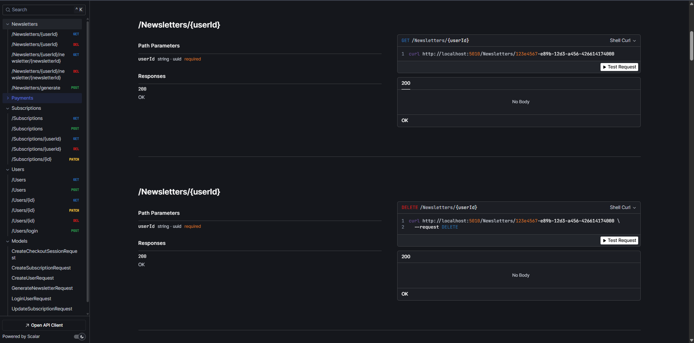

## 📬 NewsLetter API

### 📖 Descrição

O NewsLetter API é um sistema de assinatura onde o usuário se cadastra e recebe conteúdos mensais diretamente no seu e-mail, de acordo com seus interesses.
A aplicação foi desenvolvida utilizando ASP.NET 9.0, com Dapper como ORM, PostgreSQL como banco de dados (rodando em Docker), Hangfire para execução de jobs em segundo plano e integração de pagamentos via Stripe.
A comunicação assíncrona e o disparo de eventos entre serviços são realizados através do Kafka.

### 🚀 Tecnologias Utilizadas


- [.NET](https://dotnet.microsoft.com/pt-br/)
- [ASP.NET](https://learn.microsoft.com/pt-br/aspnet/core/?view=aspnetcore-9.0&WT.mc_id=dotnet-35129-website)
- [JWT](https://jwt.io/)
- [Dapper](https://www.learndapper.com/)
- [Postgresql](https://www.postgresql.org/)
- [XUnit](https://learn.microsoft.com/pt-br/dotnet/core/testing/unit-testing-csharp-with-xunit)
- [Moq](https://learn.microsoft.com/pt-br/shows/visual-studio-toolbox/unit-testing-moq-framework)

## Documentação

Api Documentada com scalar acesse  http://localhost:5010/scalar



## 🔧 **DevOps e Deploy**

- [Git](https://git-scm.com)
- [Docker](https://www.docker.com/)


##  🚀 Como Rodar o Projeto

Para rodar o projeto em seu ambiente local, siga os passos abaixo:

1. ####  Clonar o Repositório
    Primeiramente, clone o repositório do GitHub para sua máquina local:

        $ git clone https://github.com/Faelkk/NewsLetter

2.  ####  Instalar as Dependências
    Acesse o diretório do projeto e instale as dependências:

        $ dotnet restore

3. #### Configure as variaveis de ambiente

```` Logging

# ASP.NET
AllowedHosts=*

# Banco de Dados
ConnectionStrings__DefaultConnection=Host=postgres_db;Database=mydatabase;Username=myuser;Password=mypassword

# JWT
Jwt__Key=chave_super_secreta
Jwt__Issuer=NewsletterAPI
Jwt__Audience=NewsletterClient
Jwt__ExpireMinutes=10080

# Stripe
Stripe__SecretKey=sua_chave_stripe
Stripe__WebhookSecret=seu_webhook_secret
Stripe__Prices__Monthly=price_monthly_id
Stripe__Prices__Quarterly=price_quarterly_id
Stripe__Prices__Yearly=price_yearly_id

# Gemini
Gemini__ApiKey=sua_chave_gemini

# Email
EmailSettings__SmtpServer=smtp.gmail.com
EmailSettings__From=seu_email@gmail.com
EmailSettings__Password=sua_senha_app
EmailSettings__Port=587
 ````

4. #### Configurar o Docker Compose
     Antes de rodar o projeto, configure as variáveis do docker-compose de acordo com as suas necessidades. Certifique-se de que o Docker e o Docker Compose estão instalados corretamente em sua máquina.

5. ### Construir o Projeto com Docker
    Crie as imagens do Docker para o projeto:

        $ docker compose build

6. ####  Subir o Projeto
    Finalmente, suba o projeto utilizando Docker Compose:

        $ docker compose up -d

<br>

## 🧪 Como Rodar os testes
O projeto possui testes automatizados para garantir a qualidade do código e o funcionamento correto das funcionalidades implementadas. Veja abaixo como executar esses testes:

### ✅ Executar Testes Unitários 

Abra o terminal na pasta NewsLetter.Test do projeto e execute o comando:

    $ dotnet test
### 🧩 Executar Testes de Integração

Abra o terminal na pasta NewsLetter.Test.Test do projeto e Execute o comando:

    $ dotnet test

### 🤝 **Como Contribuir?**

- ⭐ Deixe uma estrela no repositório.
- 🔗 Me siga aqui no GitHub.
- 👥 Conecte-se comigo no LinkedIn e faça parte da minha rede profissional.

### 👨‍💻**Autor**
Desenvolvido por [Rafael Achtenberg](linkedin.com/in/rafael-achtenberg-7a4b12284/).
